# Aleo Shield Wallet — Documentation

> **Shield is a self-custodial browser wallet for [Aleo](https://aleo.org).** It holds private keys on the user's device, exposes Aleo's public/private balance model as first-class wallet primitives, and supports cross-chain swaps from Bitcoin, Ethereum, Solana, and other networks *into* Aleo-side privacy assets via [Hyperlane](https://www.hyperlane.xyz).

This folder contains two FAQ guides — one for end-users, one for dApp developers — plus a deployable Astro docs site that renders both.

| Document | Read this if you... |
|----------|---------------------|
| **[USERS.md](./USERS.md)**           | …installed Shield and want to know what each button does, what "Joined Records" means, how cross-chain swaps work, and which security toggles matter |
| **[DEVELOPERS.md](./DEVELOPERS.md)** | …are building an Aleo dApp and need to know what Shield's `window.shield` adapter exposes, the integration patterns, and the current `signTransition` gap |

---

## Capabilities at a glance

```mermaid
flowchart TD
    Shield(["🛡️ Shield Wallet<br/>browser extension · v1.18.0"])

    Shield --> Accounts["Accounts<br/>multi-wallet · multi-account"]
    Shield --> Balances["Balances<br/>public &harr; private"]
    Shield --> Actions["Home actions"]
    Shield --> Security["Security &amp; privacy"]
    Shield --> Swap["Cross-chain Swap (BETA)"]

    Accounts --> A1["Bookmarked addresses"]
    Accounts --> A2["Connected dApps"]

    Balances --> B1["Public balance<br/>(visible on Aleo explorer)"]
    Balances --> B2["Private balance<br/>(encrypted records)"]
    Balances --> B3["Joined Records<br/>(record consolidation)"]

    Actions --> AC1["Send · public or private"]
    Actions --> AC2["Receive · same address for both"]
    Actions --> AC3["Shield · public &rarr; private"]
    Actions --> AC4["Swap · cross-chain on-ramp"]

    Security --> S1["Lock timeout"]
    Security --> S2["Proving mode<br/>Delegated · Local"]
    Security --> S3["Record management<br/>Automatic · Manual"]
    Security --> S4["Proving keys<br/>download · view"]
    Security --> S5["Reset wallet<br/>(Danger Zone)"]

    Swap --> From["FROM: asset you spend<br/>BTC · ETH · SOL · TRX · BNB<br/>XMR · ZEC · USDC/USDT/WBTC<br/>on Arbitrum · Base · Ethereum<br/>BSC · Solana · Tron"]
    Swap --> To["TO: asset received on Aleo<br/>ALEO · USAD · USDCX<br/>ETH · USDC · USDT<br/>WBTC · WSOL<br/>(some via Hyperlane)"]
    From -.->|one-way<br/>privacy on-ramp| To

    classDef root fill:#0b1220,stroke:#22d3ee,stroke-width:2px,color:#f8fafc;
    classDef cat fill:#1e293b,stroke:#475569,color:#e2e8f0;
    classDef leaf fill:#0f172a,stroke:#334155,color:#cbd5e1;
    classDef from fill:#1e1b4b,stroke:#818cf8,color:#e0e7ff;
    classDef to fill:#064e3b,stroke:#34d399,color:#d1fae5;
    class Shield root;
    class Accounts,Balances,Actions,Security,Swap cat;
    class A1,A2,B1,B2,B3,AC1,AC2,AC3,AC4,S1,S2,S3,S4,S5 leaf;
    class From from;
    class To to;
```

The load-bearing fact: **`From` is what you spend; `To` is what arrives on Aleo**. Shield's swap is a one-way privacy on-ramp, not a generic DEX. Bringing assets out of Aleo to other chains is a separate bridge-level operation.

---

## What each guide covers

### [USERS.md](./USERS.md) — end-user FAQ

- The basics — self-custody, comparison with MetaMask / Phantom
- Public vs private balances — what the explorer can and can't see
- The four home buttons — Send, Receive, Shield, Swap
- Activity & "Joined Records" — record consolidation explained
- Cross-chain swaps — full From / To token catalogue, slippage, "via Hyperlane"
- Security settings — Lock timeout, Proving mode, Record management, Reset wallet
- Preferences — Connected dApps, Bookmarks, Network, Wallet View
- Privacy & disclosure — what an explorer sees, when Shield asks for a view key
- Recovery — seed phrase, lost password, Reset wallet implications
- Troubleshooting — slow proving, stuck swaps, dApp connection issues

### [DEVELOPERS.md](./DEVELOPERS.md) — dApp integration FAQ

- What Shield exposes today (`connect`, `signMessage`, `executeTransaction`, `decrypt`, `requestRecords`, …) and what it doesn't
- The `signTransition` gap — why `signMessage` ≠ what a transition needs (`tvk`, `skTag`); why `executeTransaction` welds three operations
- Three integration patterns — full execute-via-wallet, server-side DPS, external signing + DPS
- Records, view keys, and what the user's Proving mode means for your dApp's UX
- Network handling — mainnet vs testnet program IDs
- Cross-chain swaps from a developer perspective
- Roadmap & known gaps as of April 2026

---

## Deploying these as a website

The two FAQs are written so they can be deployed as-is to a Vercel-hosted documentation site. The minimal Astro Starlight scaffold is in [`./site/`](./site/) — see [`./site/README.md`](./site/README.md) for `npm run dev` and `npx vercel` steps.

The canonical content stays in this folder; the site references it via a small sync script (no duplication). Editing `USERS.md` or `DEVELOPERS.md` flows through to the deployed site on the next build.

---

*Verified against Shield v1.18.0 — April 2026. Wallet behavior changes; if a screen no longer matches the guides, please open an issue.*
